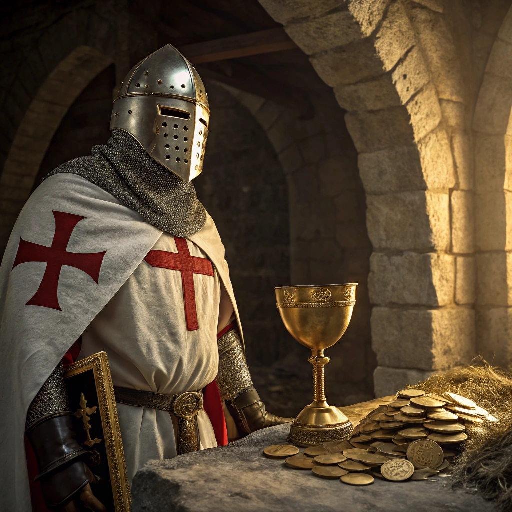

# 🏆 Perceval's Trial of Honor

  
  
<em>Perceval, noble guardian of Camelot's treasures</em>

## Concept

Perceval's Trial of Honor is a medieval-themed challenge where players submit quests to prove their worthiness to Perceval, the noble guardian of Camelot's treasures. Each quest is judged based on ancient virtues of chivalry, nobility, and honor.

## How It Works

1. **Submit Thy Quest** - Present your noble cause to Perceval using Royal Scrolls
2. **Face Judgment** - Perceval will evaluate your quest's worthiness
3. **Claim Treasure** - Worthy quests are granted access to the treasure pool
4. **Build the Bounty** - Failed quests increase the treasure for future seekers

## Royal Scrolls

- Each quest attempt requires one Royal Scroll
- Royal Scrolls can be acquired through:
  - The Black Market (purchase through STARS|TON|SOL)
  - Completing special challenges
  - Trading with other knights
  - Initial allocation (5 scrolls upon joining)

## Treasure Pools

The treasure grows with each failed quest, creating increasingly valuable prize pools for those who prove worthy.

## Judgment Criteria

Perceval judges quests based on:

- Nobility of purpose
- Purity of heart
- Wisdom of intent
- Humility in approach
- Courage in truth
- Honor in deed
- Compassion for others

Join the knights of the realm and test your virtue in Perceval's Trial of Honor!
